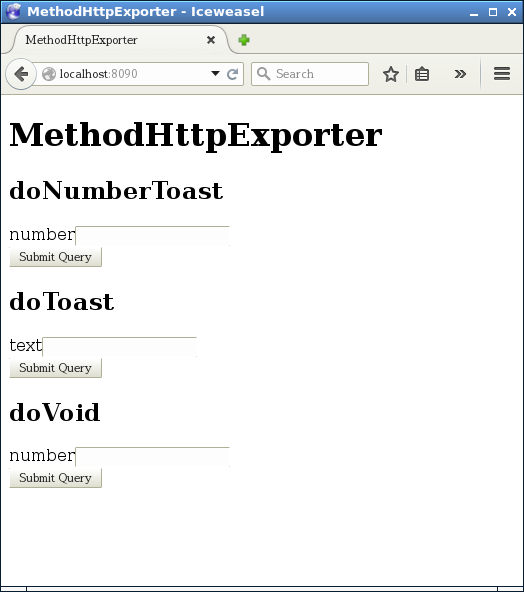

MethodHttpExporter
==================

This is development helper tool for Anndroid application.
We need execute some method from extraneous and get result.
This provides some utility class for its purpose.
It is small HTTP server. You can execute some methods directly from web browser.
The methods that wil be executed are always running on UIThread.

<!--
## Documents

[Please look at Wiki](https://github.com/cattaka/CatHandsGendroid/wiki)

## Sample Application

[FastCheckList](https://github.com/cattaka/FastCheckList)

-->

## Example

[Whole sample code you can get from here](https://github.com/cattaka/MethodHttpExporterSample)

When you have following class. It has a method that shows toast.
And  it has @ExportMethodHttp annotations.
ExportMethodHttp generates utility class named **SimpleToastHttpServer**.

```java
package net.cattaka.android.learnmethodhttpexporter;

import android.content.Context;
import android.widget.Toast;

import net.cattaka.util.methodhttpexporter.annotation.ExportMethodHttp;

/**
 * Created by cattaka on 14/09/19.
 */
@ExportMethodHttp
public class SimpleToast {
    private Context mContext;

    @ExportMethodHttpAttr
    public SimpleToast(Context mContext) {
        this.mContext = mContext;
    }

    @ExportMethodHttpAttr
    public String doToast(String text) {
        Toast.makeText(mContext, text, Toast.LENGTH_SHORT).show();
        return "Succeed";
    }
}

```

Then, **SimpleToastHttpServer** class will generated by APT after build.
Next, You need to add code like following to **Application** class.
```java
public class MyApplication extends Application {
    @Override
    public void onCreate() {
        super.onCreate();
        {   // Create Development tool and run
            SimpleToast simpleToast = new SimpleToast(this);
            SimpleToastHttpServer server = new SimpleToastHttpServer(simpleToast);
            try {
                server.run(8090);   // port number of HttpServer
            } catch (IOException e) {
                throw new RuntimeException(e);
            }
        }
    }
}

```

That's all for editng code.
Try to access "http://localhost:8090/", you will see list of methods and forms.
And access "http://localhost:8090/doToast?text=helloFromBrowser",
you will see Toast that has "helloFromBrowser" message.



## License
```
Copyright 2014 Takao Sumitomo

   Licensed under the Apache License, Version 2.0 (the "License");
   you may not use this file except in compliance with the License.
   You may obtain a copy of the License at

       http://www.apache.org/licenses/LICENSE-2.0

   Unless required by applicable law or agreed to in writing, software
   distributed under the License is distributed on an "AS IS" BASIS,
   WITHOUT WARRANTIES OR CONDITIONS OF ANY KIND, either express or implied.
   See the License for the specific language governing permissions and
   limitations under the License.
```
